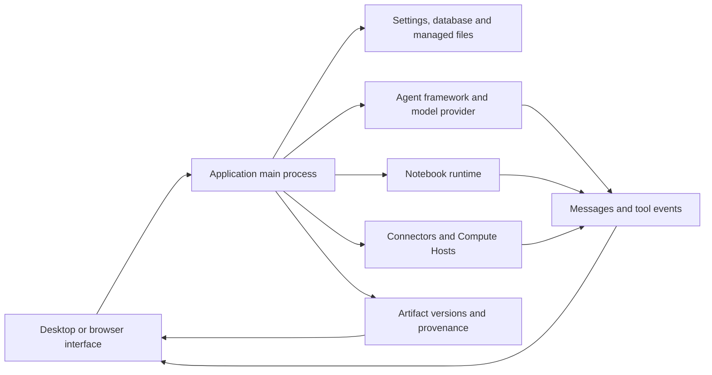

# Architecture and diagnostics

Locate a failure by the component that owns the operation. A successful model response, a successful calculation and a verified saved artifact are different observations; collect the evidence for the stage that failed.

## Architecture and ownership

| Component | Owns | Evidence to inspect |
| --- | --- | --- |
| Renderer and preview | Display state, controls, rendered file content | Page, selected project/session, filename, preview error |
| Main process | Persistent operations, application services and access boundaries | Operation error and associated diagnostics |
| Agent framework/provider | Model connection, task execution protocol and response stream | Framework/provider/model, connection test, failing tool or turn |
| Notebook | Interpreter, code execution, outputs and live variables | Runtime ID/version, failing cell, stdout/stderr and execution record |
| Connector | External service request | Connector/tool name, sanitized inputs, status/error from the service |
| Remote Compute Host | SSH access and direct/scheduled jobs | Host/mode, probe result, job ID and remote logs |
| Artifact repository | Managed versions, checksums and captured evidence | File/version ID, content status, Code/Environment/Review tabs |

The desktop path crosses the preload API boundary. Browser access uses the application's protected local service transport; see [Headless service and browser access](server.md). The browser is not a second independent research database.

## Distinguish content from evidence

| State or message | Interpretation | Next check |
| --- | --- | --- |
| Artifact content available | The selected version's bytes are readable and pass the applicable integrity check | Inspect whether the scientific result is correct |
| Content unavailable: missing | The expected content cannot be found | Preserve the version identity and investigate storage availability |
| Content unavailable: checksum mismatch | The content does not match its recorded integrity value | Retain the diagnostic; do not silently replace bytes and call it the same version |
| Partial environment capture | The environment record is incomplete | Read capture warnings and retain interpreter/package details independently |
| Bounded execution log | Only bounded immutable execution evidence was retained | Inspect gap warnings and the live Notebook where available |
| No review for this version | No applicable Reviewer result is attached | Do not report that version as reviewed |

These states can coexist. Inspect content integrity, execution evidence and review status separately.

## Error lookup

| Failure surface | Canonical lookup |
| --- | --- |
| Model/API, Connector or proxy HTTP responses | [HTTP status codes](../guides/troubleshooting.md#http-errors-400-403-429-and-5xx) |
| App cannot open its database | [Database startup codes](../guides/troubleshooting.md#database-startup-errors) |
| Notebook imports, file paths and permissions | [Error messages](../guides/troubleshooting.md#match-the-error-message) |
| SSH transport, remote paths and job status | [Remote errors](../guides/remote-compute.md#resolve-ssh-and-job-errors) |
| Issue submission and community help | [Report a bug or ask the community](../guides/troubleshooting.md#report-a-bug-or-ask-the-community) |

Keep the error's source with its identifier. An OS errno, a Python exception, a remote job error code and a provider's HTTP status are not interchangeable. Copy the accompanying message and nested cause when available; one identifier can cover several failure paths.

## Preserve a useful diagnostic record

Record the app version, operating system, affected project/session, operation, expected result, exact error and what happened immediately before it. Include the runtime and input checksum when a calculation is involved; include the artifact version or remote job ID when one exists.

Use an available **Details**, **Diagnostic details** or log view to retain the error's cause, rather than only its short heading. Reproduce with public or minimal input when possible. Inspect anything you share for account tokens, headers, private paths and research content.

The main-process logger writes structured JSON lines. Its defaults rotate files at 5 MiB and keep three files in total; special fatal-write behavior can exceed the ordinary bound by one record. Logs therefore have a retention window and are not a permanent audit trail. A diagnostic field can also be truncated. Preserve a relevant record soon after the failure and distinguish absence from proof that an event never occurred.

Source: [logger and retention](https://github.com/aipoch/open-science/blob/v0.26.0/src/main/logger.ts), [diagnostic redaction](https://github.com/aipoch/open-science/blob/v0.26.0/src/main/diagnostic-redaction.ts), [bounded Notebook failure detail](https://github.com/aipoch/open-science/blob/v0.26.0/src/main/notebook/failure-diagnostic.ts) and [artifact content status](https://github.com/aipoch/open-science/blob/v0.26.0/src/main/artifacts/provenance-content-status.ts).

First distinguish a failed operation from failed refresh/cleanup after a committed change, and distinguish background job completion from result delivery. Inspect saved state before retrying a mutation. The user-facing [recovery table](../guides/troubleshooting.md#recovery-messages) covers blocked queue restoration, retained PDF references, stale collection edits and Windows installer messages. [Background tasks](../guides/notebook.md#background-tasks-and-result-delivery) explains execution status; remote monitoring errors remain separate from final job outcomes.

## Session diagnostic archives {/* #session-diagnostic-archive */}

**Export diagnostics…** collects chosen session metadata, database records and available application log metadata into a local archive with a manifest and export log. Missing sources do not stop the whole export; large or damaged sources can produce summaries. The current and historical application logs can cover activity outside the selected session, so review the selected sources and capture outcomes.

Ordinary metadata sources exclude private content fields. After a sensitive-content package-export failure, the dialog can also offer redacted scanner evidence and original flagged files. Original files are unchecked by default; explicitly selecting them includes their original bytes. Export makes no upload or model request. Inspect the resulting archive before sharing. It does not replace a research-package backup or a minimal reproduction. See [the illustrated export procedure](../guides/troubleshooting.md#session-diagnostics).
