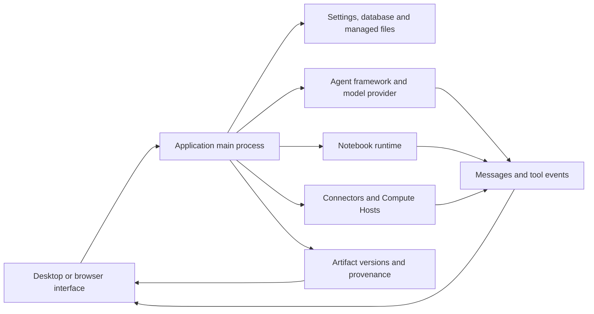

# Architektur und Diagnostik {/* #architecture-and-diagnostics */}

Suchen Sie einen Fehler durch die Komponente, die die Operation besitzt. Eine erfolgreiche Modellantwort, eine erfolgreiche Berechnung und ein verifiziertes gespeichertes Artefakt sind unterschiedliche Beobachtungen; Sammeln Sie die Beweise für die Phase, die fehlgeschlagen ist.

## Architektur und Eigentum {/* #architecture-and-ownership */}

| Komponente | Besitz | Untersuchungsnachweise |
| --- | --- | --- |
| Renderer und Preview | Anzeigezustand, Steuerelemente, gerenderter Dateiinhalt | Seite, ausgewähltes Projekt/Session, Dateiname, Vorschaufehler |
| Main-Prozess | Persistente Operationen, Anwendungsdienste und Zugriffsgrenzen | Betriebsfehler und zugehörige Diagnose |
| Agent Framework/Provider | Modellverbindung, Aufgabenausführungsprotokoll und Antwortstrom | Framework/Provider/Modell, Verbindungstest, ausfallendes Werkzeug oder Wende |
| Notebook | Interpreter, Codeausführung, Outputs und Live-Variablen | Laufzeit-ID/-Version, ausfallende Zelle, Stdout/Stderr und Ausführungsprotokoll |
| Konnektor | Externes Dienstleistungsersuchen | Connector/Toolname, bereinigte Eingaben, Status/Fehler aus dem Dienst |
| Remote Compute Host | SSH-Zugang und direkte/geplante Arbeitsplätze | Host/Modus, Sondenergebnis, Job-ID und Fernprotokolle |
| Artefakt-Repository | Verwaltete Versionen, Prüfsummen und erfasste Beweise | Datei-/Versions-ID, Inhaltsstatus, Registerkarten Code/Umgebung/Überprüfung |

Der Desktop-Pfad kreuzt die Preload-API-Grenze. Der Browserzugriff nutzt den geschützten lokalen Service-Transport der Anwendung; siehe [Headless Service und Browserzugriff](server.md). Der Browser ist keine zweite unabhängige Forschungsdatenbank.

## Unterscheiden Sie den Inhalt von Beweisen {/* #distinguish-content-from-evidence */}

| Zustand oder Nachricht | Auslegung | Nächste Prüfung |
| --- | --- | --- |
| Artefaktinhalte verfügbar | Die Bytes der ausgewählten Version sind lesbar und bestehen die entsprechende Integritätsprüfung | Prüfen Sie, ob das wissenschaftliche Ergebnis korrekt ist |
| Inhalt nicht verfügbar: fehlt | Der erwartete Inhalt kann nicht gefunden werden | Bewahren Sie die Versionsidentität und untersuchen Sie die Speicherverfügbarkeit |
| Inhalt nicht verfügbar: Checksum Mismatch | Der Inhalt entspricht nicht seinem aufgezeichneten Integritätswert | die Diagnose aufbewahren; Ersetzen Sie Bytes nicht stillschweigend und nennen Sie es dieselbe Version |
| Teilweise Erfassung der Umgebung | Die Umweltbilanz ist unvollständig | Lesen Sie Capture Warnhinweise und behalten Sie die Interpreter-/Paketdetails unabhängig |
| Bounded Execution Log | Nur begrenzte unveränderliche Vollstreckungsbeweise wurden aufbewahrt | Überprüfen Sie Lückenwarnungen und das Live-Notebook, wenn verfügbar |
| Kein Review für diese Version | Kein gültiges Reviewer-Ergebnis ist beigefügt | Melden Sie diese Version nicht als überprüft |

Diese Staaten können nebeneinander existieren. Überprüfen Sie die Integrität der Inhalte, den Ausführungsnachweis und den Überprüfungsstatus separat.

## Fehlersuche {/* #error-lookup */}

| Bruchfläche | Canonischer Lookup |
| --- | --- |
| Modell/API, Connector oder Proxy HTTP Antworten | [HTTP Statuscodes](../guides/troubleshooting.md#http-errors-400-403-429-and-5xx) |
| App kann ihre Datenbank nicht öffnen | [Datenbank-Startcodes](../guides/troubleshooting.md#database-startup-errors) |
| Notebook-Importe, Dateipfade und Berechtigungen | [Fehlermeldungen](../guides/troubleshooting.md#match-the-error-message) |
| SSH-Transport, Fernwege und Stellenstatus | [Fernfehler](../guides/remote-compute.md#resolve-ssh-and-job-errors) |
| Einreichung von Themen und Community-Hilfe | [Melden Sie einen Bug oder fragen Sie die Community](../guides/troubleshooting.md#report-a-bug-or-ask-the-community) |

Behalten Sie die Quelle des Fehlers mit seinem Identifikator. Ein OS errno, eine Python-Ausnahme, ein Remote-Job-Fehlercode und der HTTP-Status eines Anbieters sind nicht austauschbar. Kopieren Sie die begleitende Nachricht und verschachtelte Ursache, wenn verfügbar; ein Identifikator mehrere Fehlerpfade abdecken kann.

## Bewahren Sie eine nützliche Diagnoseaufzeichnung auf {/* #preserve-a-useful-diagnostic-record */}

Notieren Sie die App-Version, das Betriebssystem, das betroffene Projekt / die betroffene Sitzung, den Betrieb, das erwartete Ergebnis, den genauen Fehler und das, was unmittelbar davor passiert ist. Integrieren Sie die Laufzeit- und Eingabeprüfsumme, wenn eine Berechnung erforderlich ist; Fügen Sie die Artefaktversion oder die Remote-Job-ID hinzu, wenn eine vorhanden ist.

Verwenden Sie eine verfügbare **Details**-, **Diagnosedetails**- oder Protokollansicht, um die Ursache des Fehlers beizubehalten und nicht nur seine kurze Überschrift. Reproduzieren Sie mit öffentlichem oder minimalem Input, wenn möglich. Überprüfen Sie alles, was Sie teilen, auf Konto-Token, Header, private Pfade und Forschungsinhalte.

Der Hauptprozesslogger schreibt strukturierte JSON-Zeilen. Seine Standardeinstellungen drehen Dateien bei 5 MiB und behalten insgesamt drei Dateien; Ein spezielles fatales Schreibverhalten kann die gewöhnliche Grenze eines Datensatzes überschreiten. Logs haben daher ein Aufbewahrungsfenster und sind kein permanenter Audit-Trail. Ein Diagnosefeld kann auch abgeschnitten werden. Bewahren Sie kurz nach dem Ausfall einen relevanten Datensatz auf und unterscheiden Sie die Abwesenheit vom Nachweis, dass ein Ereignis nie stattgefunden hat.

Quelle: [Logger und Retention](https://github.com/aipoch/open-science/blob/v0.26.0/src/main/logger.ts), [Diagnoseredaktion](https://github.com/aipoch/open-science/blob/v0.26.0/src/main/diagnostic-redaction.ts), [Begrenztes Notebook Fehlerdetail](https://github.com/aipoch/open-science/blob/v0.26.0/src/main/notebook/failure-diagnostic.ts) und [Status des Artefaktinhalts](https://github.com/aipoch/open-science/blob/v0.26.0/src/main/artifacts/provenance-content-status.ts).

Unterscheiden Sie zunächst eine fehlgeschlagene Operation von einer fehlgeschlagenen Aktualisierung/Bereinigung nach einer festgelegten Änderung und unterscheiden Sie den Abschluss des Hintergrundauftrags von der Ergebnislieferung. Überprüfen Sie den gespeicherten Zustand, bevor Sie eine Mutation erneut versuchen. Die benutzerseitige [Wiederfindungstabelle](../guides/troubleshooting.md#recovery-messages) deckt blockierte Warteschlangenwiederherstellung, beibehaltene PDF-Referenzen, veraltete Sammlungsbearbeitungen und Windows-Installationsnachrichten ab. [Hintergrundaufgaben](../guides/notebook.md#background-tasks-and-result-delivery) erklärt den Ausführungsstatus; Fernüberwachungsfehler bleiben von den endgültigen Arbeitsergebnissen getrennt.

## Sitzungsdiagnostikarchive {/* #session-diagnostic-archive */}

**Export diagnostics…** sammelt ausgewählte Sitzungsmetadaten, Datenbankdatensätze und verfügbare Anwendungsprotokoll-Metadaten in einem lokalen Archiv mit einem Manifest und Exportprotokoll. Fehlende Quellen stoppen nicht den gesamten Export; große oder beschädigte Quellen können Zusammenfassungen erzeugen. Die aktuellen und historischen Anwendungsprotokolle können Aktivitäten außerhalb der ausgewählten Sitzung abdecken, also überprüfen Sie die ausgewählten Quellen und erfassen Sie die Ergebnisse.

Gewöhnliche Metadatenquellen schließen private Inhaltsfelder aus. Nach einem fehlgeschlagenen Paketexport von sensiblen Inhalten kann der Dialog auch redigierte Scannernachweise und markierte Originaldateien anbieten. Originaldateien werden standardmäßig nicht überprüft; Sie explizit auszuwählen, beinhaltet ihre ursprünglichen Bytes. Export macht keine Upload- oder Modellanforderung. Überprüfen Sie das resultierende Archiv vor dem Teilen. Es ersetzt kein Research-Paket-Backup oder eine minimale Reproduktion. Siehe [das dargestellte Ausfuhrverfahren](../guides/troubleshooting.md#session-diagnostics).