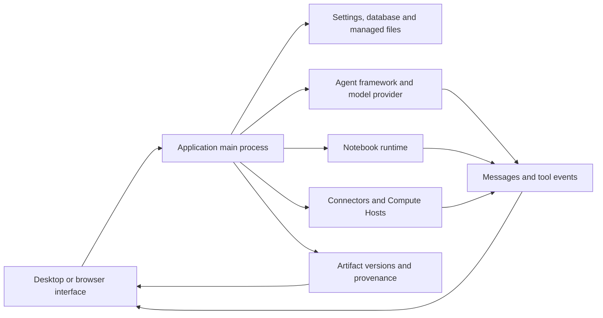

# Arquitectura y diagnósticos {/* #architecture-and-diagnostics */}

Localice un fallo por el componente que posee la operación. Una respuesta modelo exitosa, un cálculo exitoso y un artefacto salvado verificado son diferentes observaciones; recoger las pruebas para la etapa que falló.

## Arquitectura y propiedad {/* #architecture-and-ownership */}

| Componente | Owns | Pruebas para inspeccionar |
| --- | --- | --- |
| Renderer y vista previa | Mostrar estado, controles, contenido de archivo renderizado | Page, seleccionado proyecto/sesión, nombre de archivo, error de vista previa |
| Proceso Main | Operaciones persistentes, servicios de aplicaciones y límites de acceso | Error de operación y diagnósticos asociados |
| Marco de agente/providente | Conexión modelo, protocolo de ejecución de tareas y flujo de respuesta | Marco/providente/modelo, prueba de conexión, herramienta de falla o giro |
| Notebook | Intérprete, ejecución de códigos, salidas y variables en vivo | ID/versión de tiempo de ejecución, celda de falla, stdout/stderr y registro de ejecución |
| Conector | Solicitud de servicio externo | Connector/nombre de herramientas, insumos sanitarios, estado/error del servicio |
| Host de carga remota | Acceso a la SSH y empleos directos y programados | Host/mode, resultado de sonda, ID de trabajo y registros remotos |
| Repositorio de artefactos | Administrar versiones, cheques y pruebas capturadas | ID de archivo/versión, estado de contenido, fichas de código/medio/revisión |

El camino de escritorio cruza el límite API precarga. El acceso del navegador utiliza el transporte de servicio local protegido de la aplicación; ver [Servicio sin cabeza y acceso al navegador](server.md). El navegador no es una segunda base de datos de investigación independiente.

## Distinguir el contenido de las pruebas {/* #distinguish-content-from-evidence */}

| Estado o mensaje | Interpretación | Siguiente verificación |
| --- | --- | --- |
| Contenido del artefacto disponible | Los bytes de la versión seleccionada son legibles y pasan el cheque de integridad aplicable | Inspeccione si el resultado científico es correcto |
| Contenido no disponible: falta | El contenido esperado no se puede encontrar | Preserve la identidad de la versión e investigue disponibilidad de almacenamiento |
| Contenido no disponible: checksum desajusttch | El contenido no coincide con su valor de integridad registrado | Retener el diagnóstico; no sustituya silenciosamente los bytes y lo llame la misma versión |
| Captura parcial del medio ambiente | El registro ambiental es incompleto | Lea advertencias de captura y retenga detalles de intérprete/paquete de forma independiente |
| Registro de ejecución herido | Sólo se mantuvieron pruebas de ejecución inmutables vinculadas | Inspeccione advertencias de brecha y el Notebook en vivo donde esté disponible |
| No hay ninguna revisión para esta versión | No se adjunta el resultado del examen | No reporte la versión revisada |

Estos estados pueden coexistir. Inspeccione la integridad del contenido, evidencia de ejecución y estado de revisión por separado.

## Búsqueda de errores {/* #error-lookup */}

| Superficie de falla | Lookup canonical |
| --- | --- |
| Modelo/API, Connector o HTTP proxy | [Códigos de estado HTTP](../guides/troubleshooting.md#http-errors-400-403-429-and-5xx) |
| La aplicación no puede abrir su base de datos | [Códigos de inicio de bases de datos](../guides/troubleshooting.md#database-startup-errors) |
| Importaciones Notebook, caminos de archivo y permisos | [Mensajes de error](../guides/troubleshooting.md#match-the-error-message) |
| Transporte SSH, caminos remotos y estado de trabajo | [Errores remotos](../guides/remote-compute.md#resolve-ssh-and-job-errors) |
| Publicar la comunicación y la ayuda comunitaria | [Informar un error o preguntar a la comunidad](../guides/troubleshooting.md#report-a-bug-or-ask-the-community) |

Mantenga la fuente del error con su identificador. Un errno del sistema operativo, una excepción Python, un código de error de trabajo remoto y el estado HTTP del proveedor no son intercambiables. Copiar el mensaje acompañante y la causa anida cuando esté disponible; un identificador puede cubrir varios caminos de falla.

## Preserve un registro de diagnóstico útil {/* #preserve-a-useful-diagnostic-record */}

Grabar la versión de la aplicación, sistema operativo, proyecto/sesión afectado, operación, resultado esperado, error exacto y lo que sucedió inmediatamente antes. Incluya el tiempo de ejecución y el checksum de entrada cuando se trata de un cálculo; incluir la versión del artefacto o la identificación de trabajo remota cuando existe.

Utilice una vista de registro **Details**, **Detalles de diagnóstico** o para retener la causa del error, en lugar de sólo su encabezado corto. Reproduce con entrada pública o mínima cuando sea posible. Inspeccione todo lo que comparta para fichas de cuenta, encabezados, caminos privados y contenido de investigación.

El logger de proceso principal escribe líneas JSON estructuradas. Sus archivos rotatorios por defecto en 5 MiB y mantener tres archivos en total; un comportamiento especial de escritura mortal puede exceder el límite ordinario por un registro. Por lo tanto, los registros tienen una ventana de retención y no son una pista de auditoría permanente. Un campo de diagnóstico también puede ser truncado. Preserve un registro relevante poco después del fracaso y distinguir la ausencia de la prueba de que un evento nunca ocurrió.

Fuente: [logger y retención](https://github.com/aipoch/open-science/blob/v0.26.0/src/main/logger.ts), [Reproducción diagnóstica](https://github.com/aipoch/open-science/blob/v0.26.0/src/main/diagnostic-redaction.ts), [limitado Notebook detalle de falla](https://github.com/aipoch/open-science/blob/v0.26.0/src/main/notebook/failure-diagnostic.ts) y [estado del contenido del artefacto](https://github.com/aipoch/open-science/blob/v0.26.0/src/main/artifacts/provenance-content-status.ts).

En primer lugar, distinguir una operación fallida del refresco/limpia fallido después de un cambio cometido, y distinguir la terminación del trabajo de fondo de la entrega de resultados. Inspeccione el estado salvado antes de reintentar una mutación. El [Cuadro de recuperación](../guides/troubleshooting.md#recovery-messages) de cara al usuario cubre la restauración de colas bloqueadas, referencias retenidas PDF, ediciones de colección de estalas y mensajes de instalador Windows. [Tareas en segundo plano](../guides/notebook.md#background-tasks-and-result-delivery) explica el estado de ejecución; Los errores de control remoto siguen separados de los resultados finales del trabajo.

## Archivo de diagnóstico de sesión {/* #session-diagnostic-archive */}

**Export diagnostics…** recoge metadatos de sesión elegidos, registros de bases de datos y metadatos de registro de aplicaciones disponibles en un archivo local con un registro de manifiesto y exportación. Las fuentes desaparecidas no detienen toda la exportación; fuentes grandes o dañadas pueden producir resúmenes. Los registros de aplicaciones actuales e históricos pueden cubrir la actividad fuera de la sesión seleccionada, así que revise las fuentes seleccionadas y capture los resultados.

Las fuentes ordinarias de metadatos excluyen los campos de contenido privado. Después de un fallo sensible-contenido paquete-exportación, el diálogo también puede ofrecer evidencia de escáner redacted y archivos originales marcados. Los archivos originales no se verifican por defecto; La selección explícita incluye sus bytes originales. Exportar no hace ninguna carga o solicitud de modelo. Inspeccione el archivo resultante antes de compartir. No reemplaza una copia de seguridad de paquete de investigación o una reproducción mínima. Ver [el procedimiento de exportación ilustrado](../guides/troubleshooting.md#session-diagnostics).