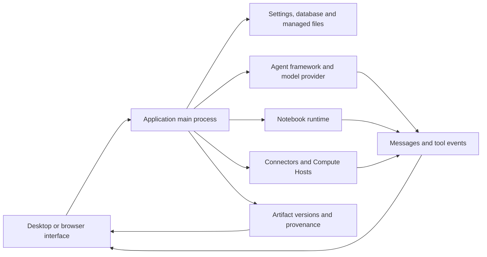

# Architecture et diagnostic {/* #architecture-and-diagnostics */}

Localiser une défaillance par le composant qui possède l'opération. Une réponse réussie du modèle, un calcul réussi et un artefact sauvegardé vérifié sont des observations différentes; recueillir les preuves pour l'étape qui a échoué.

## Architecture et propriété {/* #architecture-and-ownership */}

| Composante | Possède | Preuves à vérifier |
| --- | --- | --- |
| Rendu et prévisualisation | Affichage de l'état, des contrôles, du contenu du fichier rendu | Page, projet/session sélectionné, nom de fichier, erreur de prévisualisation |
| Processus Main | Opérations persistantes, services d'application et limites d'accès | Erreur de fonctionnement et diagnostics associés |
| Cadre/fournisseur d'agents | Connexion du modèle, protocole d'exécution des tâches et flux de réponse | Cadre/fournisseur/modèle, test de connexion, outil défaillant ou tour |
| Notebook | Interprète, exécution de code, sorties et variables en direct | ID/version d'exécution, cellule défaillante, stdout/stderr et enregistrement d'exécution |
| Connecteur | Demande de service externe | Connector/nom de l'outil, entrées désinfectées, état/erreur du service |
| Hôte de calcul à distance | Accès SSH et emplois directs/programmés | Hôte/mode, résultat de la sonde, ID de travail et journaux distants |
| Dépôt Artifact | Versions gérées, bilans de contrôle et preuves saisies | ID de fichier/version, état du contenu, onglets Code/Environnement/Examen |

Le chemin du bureau franchit la limite de précharge API. L'accès au navigateur utilise le service local protégé de l'application; Voir [Service sans tête et accès au navigateur](server.md). Le navigateur n'est pas une deuxième base de données de recherche indépendante.

## Distinguer le contenu des éléments de preuve {/* #distinguish-content-from-evidence */}

| État ou message | Interprétation | Prochaine vérification |
| --- | --- | --- |
| Contenu de l'article disponible | Les octets sélectionnés sont lisibles et passent la vérification d'intégrité applicable | Vérifier si le résultat scientifique est correct |
| Contenu non disponible : manquant | Le contenu attendu ne peut être trouvé | Préserver l'identité de la version et vérifier la disponibilité du stockage |
| Contenu non disponible : inadéquation du total de contrôle | Le contenu ne correspond pas à sa valeur d'intégrité enregistrée | Conserver le diagnostic; ne remplacez pas silencieusement les octets et appelez-le la même version |
| Capture partielle de l'environnement | Le dossier environnemental est incomplet | Lisez les avertissements de capture et conservez les détails de l'interprète ou du paquet indépendamment |
| Registre d'exécution bombé | Seuls des éléments de preuve d ' exécution immuable ont été retenus. | Inspecter les avertissements d'écart et le Notebook en direct, le cas échéant |
| Aucun avis pour cette version | Aucun résultat de l'examinateur n'est joint | Ne pas déclarer cette version telle qu'examinée |

Ces états peuvent coexister. Inspecter séparément l'intégrité du contenu, les preuves d'exécution et le statut d'examen.

## Recherche d'erreur {/* #error-lookup */}

| Surface de défaillance | Recherche canonique |
| --- | --- |
| Réponses du modèle/API, Connector ou du mandataire HTTP | [Codes d'état HTTP](../guides/troubleshooting.md#http-errors-400-403-429-and-5xx) |
| L'application ne peut pas ouvrir sa base de données | [Codes de démarrage de la base de données](../guides/troubleshooting.md#database-startup-errors) |
| Notebook importations, chemins de fichiers et permissions | [Messages d'erreur](../guides/troubleshooting.md#match-the-error-message) |
| SSH transport, chemins éloignés et statut d'emploi | [Erreurs à distance](../guides/remote-compute.md#resolve-ssh-and-job-errors) |
| Soumission de l'émission et aide communautaire | [Signaler un bug ou demander à la communauté](../guides/troubleshooting.md#report-a-bug-or-ask-the-community) |

Gardez la source de l'erreur avec son identifiant. Un OS errno, une exception Python, un code d'erreur distant et le statut HTTP d'un fournisseur ne sont pas interchangeables. Copier le message d'accompagnement et la cause imbriquée lorsque disponible; un identificateur peut couvrir plusieurs chemins de défaillance.

## Préserver un dossier de diagnostic utile {/* #preserve-a-useful-diagnostic-record */}

Enregistrez la version de l'application, le système d'exploitation, le projet/session touché, l'exploitation, le résultat attendu, l'erreur exacte et ce qui s'est passé immédiatement avant. Inclure le total des contrôles d'exécution et d'entrée lorsqu'un calcul est en cause; inclure la version d'artefact ou l'identifiant de travail à distance lorsqu'il y en a un.

Utilisez une vue **Details**, **Détails du diagnostic** ou log disponible pour conserver la cause de l'erreur, plutôt que seulement son titre court. Reproduire avec un apport public ou minimal lorsque c'est possible. Inspectez tout ce que vous partagez pour les jetons de compte, les en-têtes, les chemins privés et le contenu de recherche.

Le logger principal-processus écrit des lignes structurées JSON. Ses fichiers par défaut tournent à 5 MiB et conservent trois fichiers au total; un comportement spécial fatal-écriture peut dépasser l'ordinaire lié par un seul enregistrement. Les journaux ont donc une fenêtre de conservation et ne constituent pas une piste de vérification permanente. Un champ de diagnostic peut également être tronqué. Préserver un dossier pertinent peu après l'échec et distinguer l'absence de la preuve qu'un événement n'a jamais eu lieu.

Source: [Enregistreur et conservation](https://github.com/aipoch/open-science/blob/v0.26.0/src/main/logger.ts), [rougeur du diagnostic](https://github.com/aipoch/open-science/blob/v0.26.0/src/main/diagnostic-redaction.ts), [détail de défaillance Notebook limité](https://github.com/aipoch/open-science/blob/v0.26.0/src/main/notebook/failure-diagnostic.ts) et [état du contenu des artefacts](https://github.com/aipoch/open-science/blob/v0.26.0/src/main/artifacts/provenance-content-status.ts).

Tout d'abord, il faut distinguer une opération échouée d'un rafraîchissement ou d'un nettoyage échoué après un changement commis et il faut distinguer l'achèvement des tâches de base de l'exécution des résultats. Inspecter l'état sauvé avant de réessayer une mutation. Le [Tableau de recouvrement](../guides/troubleshooting.md#recovery-messages) orienté utilisateur couvre la restauration de la file d'attente bloquée, a conservé les références PDF, les modifications de la collection stale et les messages d'installation Windows. [Tâches en arrière-plan](../guides/notebook.md#background-tasks-and-result-delivery) explique l'état de l'exécution; Les erreurs de surveillance à distance demeurent distinctes des résultats finals.

## Archives diagnostiques des séances {/* #session-diagnostic-archive */}

**Export diagnostics…** recueille les métadonnées de session, les enregistrements de base de données et les métadonnées disponibles dans une archive locale avec un registre de manifeste et d'exportation. Les sources manquantes n'arrêtent pas l'exportation totale; Les sources importantes ou endommagées peuvent produire des résumés. Les journaux d'applications actuels et historiques peuvent couvrir les activités en dehors de la session sélectionnée, donc examiner les sources sélectionnées et saisir les résultats.

Les sources de métadonnées ordinaires excluent les champs de contenu privé. Après une défaillance de paquet-exportation sensible-contenu, la boîte de dialogue peut également offrir des preuves de scanner expurgées et des fichiers d'origine marqués. Les fichiers originaux sont décochés par défaut; Les sélectionner explicitement inclut leurs octets originaux. Exporter ne fait aucune demande de téléchargement ou de modèle. Inspectez l'archive résultante avant de partager. Il ne remplace pas une sauvegarde de paquet de recherche ou une reproduction minimale. Voir [la procédure d'exportation illustrée](../guides/troubleshooting.md#session-diagnostics).