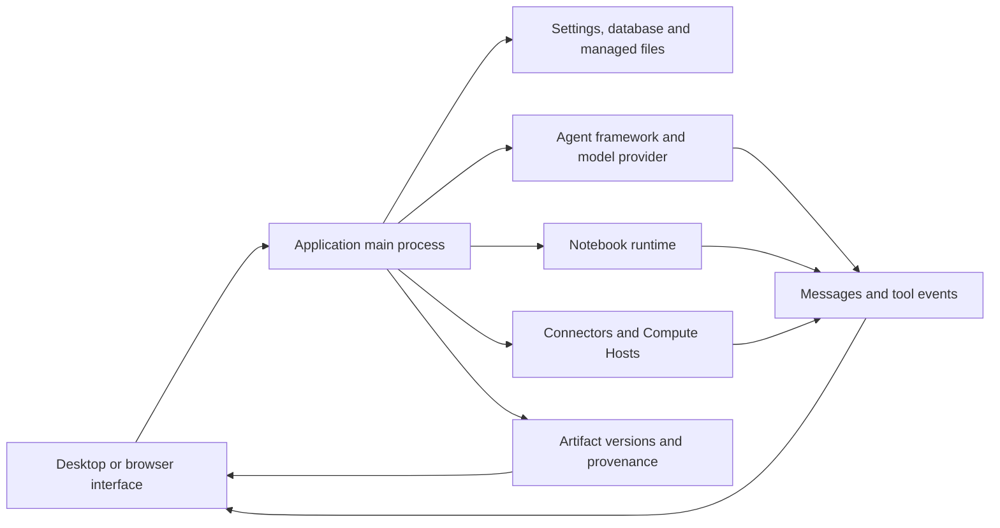

# 建築および診断 {/* #architecture-and-diagnostics */}

操作を所有するコンポーネントによって失敗を割り当てます。 成功したモデル応答、成功した計算、および検証された保存されたアーティファクトは異なる観察です。 失敗したステージの証拠を収集します。

## 建築・所有権 {/* #architecture-and-ownership */}

| コンポーネント | オーナーズ | 検査する証拠 |
| --- | --- | --- |
| レンダリングとプレビュー | 表示状態、制御、レンダリングされたファイルの内容 | ページ、選択したプロジェクト/セッション、ファイル名、プレビューエラー |
| Mainプロセス | 持続的な操作、アプリケーションサービス、アクセス境界 | 操作の間違いおよび関連の診断 |
| エージェントフレームワーク/provider | モデル接続、タスク実行プロトコル、応答ストリーム | フレームワーク/provider/modelの接続テスト、失敗する用具または回転 |
| Notebook | 通訳、コード実行、出力、ライブ変数 | Runtime ID/version、フェイリングセル、stdout/stderr、実行レコード |
| コネクタ | 外部サービスリクエスト | Connector/tool名、サニタイズされた入力、サービスからのステータス/エラー |
| リモート・コンピューティングのホスト | SSHアクセスと直接/スケジュールされたジョブ | ホスト/モード、プローブ結果、ジョブID、リモートログ |
| アーティファクトリポジトリ | 管理されたバージョン、チェックサム、およびキャプチャされた証拠 | ファイル/バージョンID、コンテンツステータス、コード/環境/レビュータブ |

デスクトップパスは、プリロードAPI境界線を渡します。 ブラウザアクセスは、アプリケーションの保護されたローカルサービス輸送を使用します。 [ヘッドレスサービスおよびブラウザアクセス](server.md) を参照してください。 ブラウザは2番目の独立した研究データベースではありません。

## 証拠からコンテンツを区別する {/* #distinguish-content-from-evidence */}

| 状態またはメッセージ | 通訳・通訳 | 次の検証 |
| --- | --- | --- |
| 利用可能なアーティファクトコンテンツ | 選択したバージョンのバイトは読みやすく、該当する整合性チェックを渡す | 科学的結果が正しいかどうかを調べる |
| コンテンツが利用できなくなった: 欠落 | 予想される内容が見つかりません | バージョン ID を保存し、ストレージの可用性を調べる |
| コンテンツ利用不可:チェックサム不一致 | コンテンツは記録された整合性値と一致しません | 診断の保持; 正式にバイトを交換し、同じバージョンを呼び出しません |
| 部分環境の捕獲 | 環境記録が不完全である | キャプチャの警告を読んで、通訳/パッケージの詳細を独立して保持します |
| 曲げられた実行ログ | 公平な実行証拠のみが保持されました。 | 警告ギャップと利用可能なライブNotebookを調べる |
| このバージョンのレビューはありません | 審査結果が添付されていない | バージョンをレビューとして報告しないでください。 |

これらの状態は共存することができます。 コンテンツの完全性、実行証拠、レビュー状況を別々に点検します。

## エラーの検索 {/* #error-lookup */}

| 失敗の表面 | キャニカルルックアップ |
| --- | --- |
| モデル/API、ConnectorまたはプロキシHTTP応答 | [HTTPステータスコード](../guides/troubleshooting.md#http-errors-400-403-429-and-5xx) |
| アプリはデータベースを開くことができません | [データベースの起動コード](../guides/troubleshooting.md#database-startup-errors) |
| Notebook のインポート、ファイルパス、権限 | [エラーメッセージ](../guides/troubleshooting.md#match-the-error-message) |
| SSHトランスポート、リモートパス、ジョブステータス | [リモートエラー](../guides/remote-compute.md#resolve-ssh-and-job-errors) |
| 課題の投稿とコミュニティの助け | [バグを報告するか、コミュニティに尋ねる](../guides/troubleshooting.md#report-a-bug-or-ask-the-community) |

エラーのソースを識別子で保持します。 OS errno、Python 例外、リモートジョブエラーコード、プロバイダの HTTP ステータスは変更できません。 添付したメッセージをコピーし、利用可能なときにネストされた原因をコピーします。 1つの識別子は、いくつかの失敗パスをカバーすることができます。

## 有用な診断記録を維持して下さい {/* #preserve-a-useful-diagnostic-record */}

アプリのバージョン、オペレーティングシステム、影響を受けたプロジェクト/セッション、動作、期待される結果、正確なエラー、およびその直前に何が起こったのかを記録します。 計算が関与したときに実行時間と入力チェックサムを含める。 既存のアーティファクトバージョンやリモートジョブ ID を含む。

利用可能な**Details**、**診断の細部**、またはログビューを使用して、エラーの原因を保持します。 可能な限り公開または最小限の入力で再生成します。 アカウントトークン、ヘッダ、プライベートパス、およびリサーチコンテンツの共有の内容を調べます。

主工程のロガーは構造化されたJSONラインを書きます。 そのデフォルトは、5 MiB でファイルを回転させ、合計で3つのファイルを保存します。 特別な致命的な書き込み動作は、1レコードによって普通の境界を超えることができます。 したがって、ログは保持ウィンドウを持っており、永久的な監査証跡はありません。 診断分野はtuncatedである場合もあります。 失敗の直後に関連レコードを保存し、イベントが起こらないという証拠から欠如を区別します。

ソース: [ロガーと保持](https://github.com/aipoch/open-science/blob/v0.26.0/src/main/logger.ts)、[診断の赤化](https://github.com/aipoch/open-science/blob/v0.26.0/src/main/diagnostic-redaction.ts)、[境界Notebookの失敗の細部](https://github.com/aipoch/open-science/blob/v0.26.0/src/main/notebook/failure-diagnostic.ts)、[成果物コンテンツのステータス](https://github.com/aipoch/open-science/blob/v0.26.0/src/main/artifacts/provenance-content-status.ts)。

最初に失敗した操作を、コミットされた変更の後で不安定な更新/cleanup から区別し、結果を配達からの背景の仕事の完了を区別して下さい。 突然変異を繰り返す前に保存された状態を点検して下さい。 [回復テーブル](../guides/troubleshooting.md#recovery-messages) は、ブロックされたキューの復元、保持された PDF リファレンス、スタイルコレクションの編集、Windows インストーラー メッセージをカバーしています。 [バックグラウンドタスク](../guides/notebook.md#background-tasks-and-result-delivery) は実行状態を説明しています。 リモート監視エラーは、最終ジョブ結果とは異なるままです。

## セッション診断アーカイブ {/* #session-diagnostic-archive */}

**Export diagnostics…**は選択したセッションメタデータ、データベースレコード、利用可能なアプリケーションログメタデータを、マニフェストとエクスポートログでローカルアーカイブに収集します。 ソースを欠落させることは、全体の輸出を停止しません。 大きいか、または損なわれた源は要約を作り出すことができます。 現在のアプリケーションログと履歴ログは、選択したセッションの外でアクティビティをカバーできるため、選択したソースとキャプチャ結果を確認します。

通常のメタデータソースは、プライベートコンテンツフィールドを除外します。 機密コンテンツのパッケージエクスポートの失敗の後、ダイアログは、赤字のスキャナーの証拠と元のフラグのファイルを提供することもできます。 元のファイルはデフォルトでチェックされていない。 それらを明示的に選択すると、元のバイトが含まれています。 エクスポートはアップロードやモデルリクエストを行わない。 共有する前に、結果のアーカイブを調べます。 研究パッケージのバックアップまたは最小限の再生を交換しません。 [記述された輸出プロシージャ](../guides/troubleshooting.md#session-diagnostics) を参照してください。