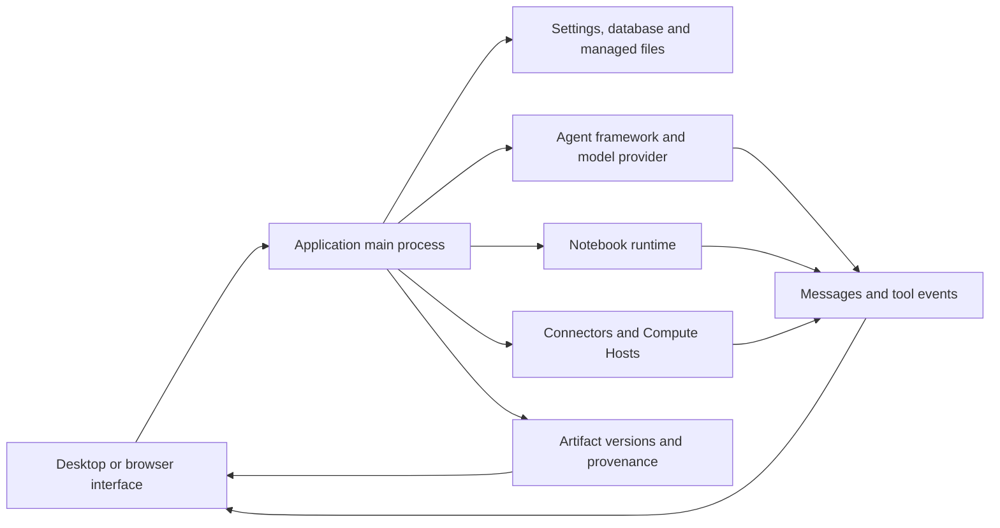

# 건축과 진단 {/* #architecture-and-diagnostics */}

작업을 소유하는 구성 요소에 의해 실패를 찾습니다. 성공적인 모델 응답, 성공적인 계산 및 검증 된 저장된 artifact는 다른 관측; 실패한 단계에 대한 증거를 수집합니다.

## 건축 및 소유권 {/* #architecture-and-ownership */}

| 회사연혁 | 이름 &#42; | 검사에 대한 증거 |
| --- | --- | --- |
| Renderer 및 미리보기 | 표시 상태, 제어, 렌더링 된 파일 내용 | 페이지, 선택한 project/session, filename, 미리보기 오류 |
| Main 과정 | Persistent 운영, 응용 서비스 및 액세스 경계 | 가동 과 관련 진단 |
| 에이전트 프레임 워크/provider | 모델 연결, 작업 실행 프로토콜 및 응답 스트림 | Framework/provider/model, 연결 테스트, 실패 도구 또는 회전 |
| Notebook | Interpreter, 코드 실행, 출력 및 실시간 변수 | Runtime ID/version, 실패 셀, stdout/stderr 및 실행 기록 |
| 커넥터 | 외부 서비스 요청 | Connector/tool 이름, sanitized 입력, 서비스에서 상태/error |
| 원격 Compute 호스트 | SSH 액세스 및 직접 / 일정한 작업 | 호스트 / 모드, 프로브 결과, 작업 ID 및 원격 로그 |
| Artifact 저장소 | 관리 된 버전, 체크섬 및 캡처 된 증거 | File/version ID, 콘텐츠 상태, Code/Environment/Review 탭 |

데스크톱 경로는 사전 로드 API 경계를 교차합니다. 브라우저 액세스는 애플리케이션의 보호 된 로컬 서비스 수송을 사용합니다. [서비스 및 브라우저 액세스](server.md) 참조. 브라우저는 두 번째 독립적 인 연구 데이터베이스가 아닙니다.

## 증거로부터 구별되는 내용 {/* #distinguish-content-from-evidence */}

| 국가 또는 메시지 | 회사연혁 | 다음 검증 |
| --- | --- | --- |
| Artifact 콘텐츠 제공 | 선택한 버전의 바이트가 읽기 쉽고 적용 가능한 무결성 체크를 전달합니다. | 과학적 결과가 정확하다는 것을 검사 |
| 콘텐츠 사용 불가: 누락 | 예상된 내용은 찾을 수 없습니다. | 버전 정체성을 보존하고 저장 가용성을 조사 |
| 콘텐츠 사용 불가: checksum mismatch | 콘텐츠는 기록된 무결성 값과 일치하지 않습니다. | 진단을 유지하십시오; 은밀하게 바이트를 대체하고 같은 버전을 호출하지 마십시오 |
| Partial 환경 캡처 | 환경 기록은 불완전합니다 | 캡처 경고를 읽고 독립적으로 해석기 / 포장 세부 정보를 유지 |
| Bounded 실행 로그 | 묶인 immutable 실행 증거는 유지되었습니다 | Inspect gap 경고와 유효한 살아있는 Notebook |
| 이 버전에 대한 리뷰가 없습니다. | 적용 가능한 Reviewer 결과가 붙어 있습니다. | 리뷰로 그 버전을 보고하지 마십시오. |

이 국가는 coexist 할 수 있습니다. 콘텐츠 무결성, 실행 증거 및 검토 상태는 별도로.

## 오류 조회 {/* #error-lookup */}

| 실패 표면 | Canonical 구경 |
| --- | --- |
| 모형/API, Connector 또는 프록시 HTTP 응답 | [HTTP 상태 코드](../guides/troubleshooting.md#http-errors-400-403-429-and-5xx) |
| 앱은 데이터베이스를 열 수 없습니다. | [Database 시작 코드](../guides/troubleshooting.md#database-startup-errors) |
| Notebook 가져 오기, 파일 경로 및 권한 | [오류 메시지](../guides/troubleshooting.md#match-the-error-message) |
| SSH 수송, 먼 경로 및 일 상태 | [원격 오류](../guides/remote-compute.md#resolve-ssh-and-job-errors) |
| 문제 제출 및 커뮤니티 도움 | [버그를보고 또는 커뮤니티에 요청](../guides/troubleshooting.md#report-a-bug-or-ask-the-community) |

식별자의 오류 소스를 유지하십시오. OS errno, Python 예외, 원격 작업 오류 코드 및 공급자의 HTTP 상태는 교환할 수 없습니다. 동반된 메시지를 복사하고 사용할 때 배열된 원인을 복사; 1개의 식별자는 몇몇 실패 경로를 커버할 수 있습니다.

## 유용한 진단 기록 보존 {/* #preserve-a-useful-diagnostic-record */}

앱 버전, 운영 체제, 영향을받는 프로젝트 / 세션, 작동, 예상 결과, 정확한 오류 및 그 전에 즉시 발생. 계산이 관여될 때 runtime 및 input checksum을 포함하십시오; artifact 버전 또는 원격 작업 ID가 포함될 때 하나 존재합니다.

사용 가능한 **Details**, **진단 세부사항** 또는 로그보기 오류의 원인을 유지, 오히려 그것의 짧은 머리 보다는. 가능한 경우 공공 또는 최소 입력을 가진 Reproduce. 계정 토큰, 헤더, 개인 경로 및 연구 콘텐츠를 공유하는 모든 것을 검사합니다.

메인 프로세스 로거는 구조화 된 JSON 라인을 작성합니다. 기본적으로 5 MiB에서 파일을 회전하고 총 세 개의 파일을 유지합니다. 특별한 지방을 씁니다 행동은 1개의 기록에 의해 정규적인 경계를 초과할 수 있습니다. 따라서 보관 창을 가지고 있으며 영구 감사 흔적이 없습니다. 진단 분야는 또한 truncated 할 수 있습니다. 실패 후 관련 레코드를 보존하고 이벤트가 발생하지 않은 증거로부터 부재를 구별합니다.

소스: [Logger 및 유지](https://github.com/aipoch/open-science/blob/v0.26.0/src/main/logger.ts), [진단 redaction](https://github.com/aipoch/open-science/blob/v0.26.0/src/main/diagnostic-redaction.ts), [경계된 Notebook 실패 세부사항](https://github.com/aipoch/open-science/blob/v0.26.0/src/main/notebook/failure-diagnostic.ts) 및 [artifact 내용 상태](https://github.com/aipoch/open-science/blob/v0.26.0/src/main/artifacts/provenance-content-status.ts).

첫 번째는 실패한 작업에서 실패한 새로 고침/클립업 후, 그리고 결과 배달에서 배경 작업 완료를 구별합니다. Inspect는 뮤테이션을 재발하기 전에 국가를 저장합니다. [복구 테이블](../guides/troubleshooting.md#recovery-messages)의 사용자 인터페이스는 차단된 큐어 복원, 유지 PDF 참조, stale 컬렉션 편집 및 Windows 설치 메시지. [백그라운드 작업](../guides/notebook.md#background-tasks-and-result-delivery)은 실행 상태를 설명합니다. 원격 모니터링 오류는 최종 작업 결과에서 분리됩니다.

## 세션 진단 아카이브 {/* #session-diagnostic-archive */}

**Export diagnostics…**은 선택한 세션 메타데이터, 데이터베이스 레코드 및 사용 가능한 애플리케이션 로그 메타데이터를 현명하고 수출 로그와 현지 아카이브로 수집합니다. 근원은 전체적인 수출을 멈추지 않습니다; 큰 손상된 근원은 summaries를 일으킬 수 있습니다. 현재와 과거의 애플리케이션 로그는 선택한 세션 밖에 활동들을 커버할 수 있으므로 선택한 소스를 검토하고 결과를 캡처할 수 있습니다.

Ordinary metadata 소스는 개인 콘텐츠 필드를 제외합니다. 민감한 콘텐츠 패키지 수출 실패 후, 대화 상자는 또한 적층 스캐너 증거와 원본 조각 파일을 제공 할 수 있습니다. 원본 파일은 기본적으로 체크되지 않습니다. 명시적으로 선택하면 원래 바이트가 포함되어 있습니다. 수출은 업로드 또는 모델 요청을하지 않습니다. 공유하기 전에 결과 아카이브를 검사합니다. 연구 패키지 백업 또는 최소 재생산을 대체하지 않습니다. [illustrated 수출 절차](../guides/troubleshooting.md#session-diagnostics) 참조.