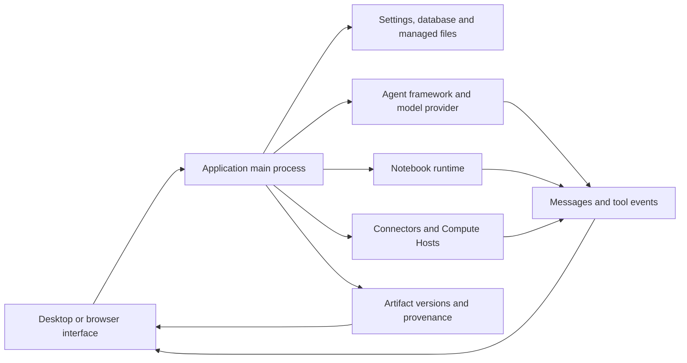

# Архитектура и диагностика {/* #architecture-and-diagnostics */}

Найдите сбой по компоненту, который владеет операцией. Успешный ответ модели, успешный расчет и проверенный сохраненный артефакт - это разные наблюдения. Соберите доказательства для сцены, которая провалилась.

## Архитектура и собственность {/* #architecture-and-ownership */}

| Компонент | собственники | Доказательства для проверки |
| --- | --- | --- |
| Рендер и превью | Состояние отображения, элементы управления, рендеринг содержимого файла | Страница, выбранный проект/сессия, имя файла, ошибка предварительного просмотра |
| Процесс Main | Постоянные операции, службы приложений и границы доступа | Операционная ошибка и связанная с ней диагностика |
| Агент фреймворк/поставщик | Модельное соединение, протокол выполнения задач и поток ответов | Framework/vider/model, тест на подключение, отказ инструмента или поворот |
| Notebook | Переводчик, выполнение кода, выходы и живые переменные | Идентификатор/версия времени выполнения, неисправная ячейка, stdout/stderr и запись исполнения |
| Коннектор | Запрос внешней службы | Connector/название инструмента, дезинфицированные входные данные, статус/ошибка в сервисе |
| Удаленный вычислительный хост | Доступ к SSH и прямые / запланированные рабочие места | Хост / режим, результат зонда, идентификатор работы и удаленные журналы |
| Репозиторий артефактов | Управляемые версии, контрольные суммы и захваченные доказательства | Идентификатор файла/версии, статус контента, вкладки Code/Environment/Review |

Путь рабочего стола пересекает границу предварительной загрузки API. Браузерный доступ использует защищенный локальный сервисный транспорт приложения; См. [Сервис без головы и доступ к браузеру](server.md). Браузер не является второй независимой базой данных.

## Отличить содержание от доказательств {/* #distinguish-content-from-evidence */}

| Государство или сообщение | Толкование | Следующая проверка |
| --- | --- | --- |
| Доступный контент Artifact | Байты выбранной версии можно прочитать и пройти соответствующую проверку целостности. | Проверьте, является ли научный результат правильным. |
| Недоступный контент: отсутствует | Ожидаемый контент не найден | Сохраняйте идентичность версии и исследуйте доступность хранилища |
| Недоступный контент: Checksum mismatch | Содержимое не соответствует его зарегистрированной ценности целостности. | сохранить диагностику; Не заменяйте байты и не называйте их одной и той же версией |
| Частичный захват окружающей среды | Экологический рекорд неполный | Прочитайте предупреждения о захвате и сохраните данные переводчика / пакета самостоятельно |
| Связанный журнал исполнения | Сохранились только ограниченные неизменные доказательства казни. | Проверяйте предупреждения о разрыве и живую Notebook, где это возможно |
| Для этой версии нет проверки | Никаких применимых результатов рецензента не прилагается | Не сообщайте об этой версии, как рассмотрено. |

Эти государства могут сосуществовать. Проверяйте целостность контента, доказательства исполнения и статус обзора отдельно.

## Поиск ошибок {/* #error-lookup */}

| Поверхность отказа | Канонический поиск |
| --- | --- |
| Реакции Model/API, Connector или proxy HTTP | [Коды состояния HTTP](../guides/troubleshooting.md#http-errors-400-403-429-and-5xx) |
| Приложение не может открыть свою базу данных | [Коды запуска базы данных](../guides/troubleshooting.md#database-startup-errors) |
| Импорт Notebook, пути файлов и разрешения | [Сообщения об ошибках](../guides/troubleshooting.md#match-the-error-message) |
| Транспорт SSH, удаленные пути и статус работы | [Дистанционные ошибки](../guides/remote-compute.md#resolve-ssh-and-job-errors) |
| Представление вопросов и помощь общин | [Сообщите об ошибке или спросите сообщество](../guides/troubleshooting.md#report-a-bug-or-ask-the-community) |

Сохраняйте источник ошибки с его идентификатором. OS errno, исключение Python, код ошибки удаленной работы и статус HTTP провайдера не являются взаимозаменяемыми. Копировать сопроводительное сообщение и вложенную причину, когда это доступно; Один идентификатор может охватывать несколько путей отказа.

## Сохранить полезную диагностическую запись {/* #preserve-a-useful-diagnostic-record */}

Запишите версию приложения, операционную систему, затронутый проект/сессию, работу, ожидаемый результат, точную ошибку и то, что произошло непосредственно перед ней. Включите контрольную сумму времени выполнения и ввода, когда речь идет о расчете; Включите версию артефакта или удаленный идентификатор работы, когда он существует.

Используйте доступный вид **Details**, **Диагностические детали** или журнал, чтобы сохранить причину ошибки, а не только ее короткий заголовок. Воспроизводить с публичным или минимальным вкладом, когда это возможно. Проверяйте все, чем вы делитесь, на токены учетных записей, заголовки, частные пути и контент исследований.

Главный регистратор процессов пишет структурированные строки JSON. По умолчанию он вращает файлы на 5 MiB и сохраняет в общей сложности три файла. Особое фатальное поведение может превышать обычное, связанное одной записью. Поэтому журналы имеют окно удержания и не являются постоянным аудиторским следом. Диагностическая область также может быть усечена. Сохраняйте соответствующую запись вскоре после неудачи и отличайте отсутствие от доказательства того, что событие никогда не происходило.

Источник: [лесозаготовитель и удержание](https://github.com/aipoch/open-science/blob/v0.26.0/src/main/logger.ts), [диагностическая редакция](https://github.com/aipoch/open-science/blob/v0.26.0/src/main/diagnostic-redaction.ts), [Обнаружена деталь отказа Notebook](https://github.com/aipoch/open-science/blob/v0.26.0/src/main/notebook/failure-diagnostic.ts) и [статус содержимого артефакта](https://github.com/aipoch/open-science/blob/v0.26.0/src/main/artifacts/provenance-content-status.ts).

Во-первых, отличить неудачную операцию от неудачного обновления / очистки после совершенного изменения и отличить завершение фоновой работы от доставки результата. Проверить состояние сохраненного состояния перед повторным повторением мутации. [Таблица восстановления](../guides/troubleshooting.md#recovery-messages), ориентированный на пользователя, охватывает блокированное восстановление очереди, сохраненные ссылки PDF, устаревшие редактирования коллекций и сообщения установщика Windows. [Фоновые задачи](../guides/notebook.md#background-tasks-and-result-delivery) объясняет статус исполнения; Погрешности удаленного мониторинга не связаны с конечными результатами работы.

## Сеансовые диагностические архивы {/* #session-diagnostic-archive */}

**Export diagnostics…** собирает выбранные метаданные сеанса, записи базы данных и доступные метаданные журнала приложений в локальный архив с манифестом и журналом экспорта. Недостающие источники не останавливают весь экспорт. Большие или поврежденные источники могут давать резюме. Текущие и исторические журналы приложений могут охватывать деятельность за пределами выбранной сессии, поэтому просмотрите выбранные источники и получите результаты.

Обычные источники метаданных исключают поля частного контента. После сбоя в экспорте пакетов с чувствительным контентом диалог может также предлагать отредактированные доказательства сканера и оригинальные файлы с пометкой. Оригинальные файлы по умолчанию не проверяются; Явный выбор включает в себя их оригинальные байты. Экспорт не делает загрузку или запрос модели. Проверяйте полученный архив перед тем, как поделиться. Он не заменяет собой резервную копию исследовательского пакета или минимальное воспроизведение. Смотрите [Иллюстрированная процедура экспорта](../guides/troubleshooting.md#session-diagnostics).