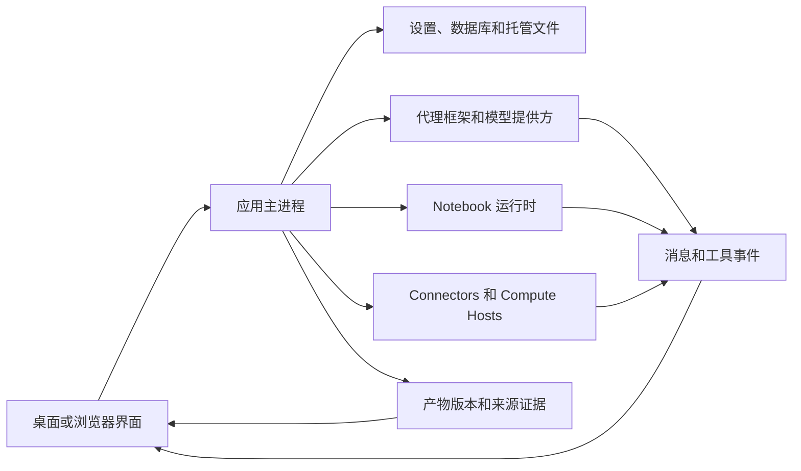

# 架构与诊断

根据操作归属定位故障。模型回复成功、计算成功和产物核验成功是不同的观察结果，应收集发生故障那个阶段的证据。

## 架构与职责

| 组件 | 负责内容 | 应检查的证据 |
| --- | --- | --- |
| 界面和预览 | 显示状态、控件、文件渲染 | 页面、当前项目／会话、文件名、预览错误 |
| 主进程 | 持久化操作、应用服务和访问边界 | 操作错误及相关诊断 |
| 代理框架／提供方 | 模型连接、执行协议和回复流 | 框架／提供方／模型、连接测试、失败工具或轮次 |
| Notebook | 解释器、代码执行、输出和实时变量 | 运行时 ID／版本、失败单元、标准输出／错误和执行记录 |
| Connector | 外部服务请求 | Connector／工具名、脱敏输入、服务状态或错误 |
| 远程 Compute Host | SSH 和直接／调度作业 | 主机／模式、探测结果、作业 ID、远程日志 |
| 产物存储 | 托管版本、校验和及捕获证据 | 文件／版本 ID、内容状态、Code／Environment／Review |

桌面入口跨越 preload API 边界。浏览器入口使用受保护的本地服务传输，见[无界面服务和浏览器访问](server.md)。浏览器不是第二套独立研究数据库。

## 区分文件内容与证据

| 状态或消息 | 含义 | 下一步 |
| --- | --- | --- |
| 产物内容可用 | 所选版本的字节可读取，并通过适用的完整性检查 | 检查科学结果是否正确 |
| 内容不可用：missing | 找不到预期内容 | 保留版本身份，检查存储可用性 |
| 内容不可用：checksum mismatch | 内容与记录的完整性值不符 | 保留诊断，不要替换字节后仍称为原版本 |
| 环境部分捕获 | 环境记录不完整 | 阅读警告，另行保留解释器和包信息 |
| 有界执行日志 | 只保留了有大小范围限制的不可变执行证据 | 查看缺口提示和可用的实时 Notebook |
| 当前版本无审核 | 没有适用 Reviewer 结果 | 不要将该版本标为已审核 |

这些状态可能同时存在，应分别检查内容完整性、执行证据和审核状态。

## 查找错误信息

| 故障位置 | 对应查询入口 |
| --- | --- |
| 模型/API、Connector 或代理的 HTTP 响应 | [HTTP 状态码](../guides/troubleshooting.md#http-错误400403429-与-5xx) |
| 应用无法打开数据库 | [数据库启动错误码](../guides/troubleshooting.md#数据库启动错误) |
| Notebook 导入、路径或权限问题 | [报错信息](../guides/troubleshooting.md#按报错信息定位) |
| SSH、远程路径和作业状态 | [远程错误](../guides/remote-compute.md#处理-ssh-与作业错误) |
| 提交缺陷与社区求助 | [问题反馈](../guides/troubleshooting.md#提交问题或向社区求助) |

记录错误标识时保留来源。系统 errno、Python 异常、远程作业错误码和 Provider HTTP 状态不可混为一谈。复制附带消息及可用的底层原因；同一个标识可能对应多种失败路径。

## 保留有用的诊断记录

记录应用版本、操作系统、受影响项目／会话、执行操作、预期结果、准确错误，以及出错前发生的事情。计算问题应包含运行时和输入校验和；有产物版本或远程作业 ID 时也应记录。

使用可用的 **Details**、**Diagnostic details** 或日志界面保留原因，不要只截取短标题。能用公开或最小输入复现时，优先保留这种复现。分享前检查账号令牌、请求头、私人路径和研究内容。

主进程日志使用结构化 JSON 行。默认单文件达到 5 MiB 时轮换，共保留三个文件；特殊致命错误写入可能多出一条记录。因此日志有保留窗口，不能当作永久审计档案。诊断字段也可能截断，故障后应及时保留相关记录。“没有找到”不等于“事件没有发生”。

源码：[日志与保留](https://github.com/aipoch/open-science/blob/v0.26.0/src/main/logger.ts)、[诊断脱敏](https://github.com/aipoch/open-science/blob/v0.26.0/src/main/diagnostic-redaction.ts)、[Notebook 错误长度限制](https://github.com/aipoch/open-science/blob/v0.26.0/src/main/notebook/failure-diagnostic.ts)、[产物内容状态](https://github.com/aipoch/open-science/blob/v0.26.0/src/main/artifacts/provenance-content-status.ts)。

排查时，先区分操作失败与提交后的刷新/清理失败，以及后台作业完成与结果送达。重试写入前检查实际保存状态。[恢复提示表](../guides/troubleshooting.md)涵盖队列恢复受阻、PDF 条目保留、集合过期编辑及 Windows 安装错误。[后台任务](../guides/notebook.md)说明执行状态，远程监控错误仍与作业最终结果分别处理。

## 会话诊断归档 {/* #session-diagnostic-archive */}

**Export diagnostics…** 将所选会话元数据、数据库记录和可用的应用日志元数据收集到本地归档，并附带清单和导出日志。部分来源缺失不会中止整个导出；过大或损坏的来源可能只生成摘要。当前及历史应用日志可能包含其他会话的活动，应检查所选来源及各自导出结果。

常规元数据来源排除隐私内容字段。研究包触发敏感内容检查后，还可选择脱敏扫描证据与原始文件。原始文件默认不勾选，主动勾选会包含其原始字节。导出不上传，也不调用模型。分享前检查归档，它不替代研究包备份或最小复现步骤。具体操作见[诊断导出图解](../guides/troubleshooting.md#session-diagnostics)。
