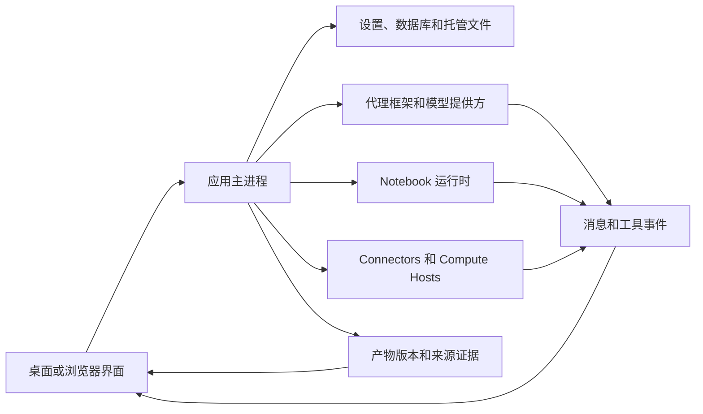

# 架構與診斷 {/* #架构与诊断 */}

根據操作歸屬定位故障。模型回覆成功、計算成功和產物核驗成功是不同的觀察結果，應收集發生故障那個階段的證據。

## 架構與職責 {/* #架构与职责 */}

| 元件 | 負責內容 | 應檢查的證據 |
| --- | --- | --- |
| 介面和預覽 | 顯示狀態、控制元件、檔案渲染 | 頁面、當前專案／會話、檔名、預覽錯誤 |
| 主程序 | 持久化操作、應用服務和訪問邊界 | 操作錯誤及相關診斷 |
| 代理框架／提供方 | 模型連線、執行協議和回覆流 | 框架／提供方／模型、連線測試、失敗工具或輪次 |
| Notebook | 直譯器、程式碼執行、輸出和實時變數 | 執行時 ID／版本、失敗單元、標準輸出／錯誤和執行記錄 |
| Connector | 外部服務請求 | Connector／工具名、脫敏輸入、服務狀態或錯誤 |
| 遠端 Compute Host | SSH 和直接／排程作業 | 主機／模式、探測結果、作業 ID、遠端日誌 |
| 產物儲存 | 託管版本、校驗和及捕獲證據 | 檔案／版本 ID、內容狀態、Code／Environment／Review |

桌面入口跨越 preload API 邊界。瀏覽器入口使用受保護的本地服務傳輸，見[無介面服務和瀏覽器訪問](server.md)。瀏覽器不是第二套獨立研究資料庫。

## 區分檔案內容與證據 {/* #区分文件内容与证据 */}

| 狀態或訊息 | 含義 | 下一步 |
| --- | --- | --- |
| 產物內容可用 | 所選版本的位元組可讀取，並透過適用的完整性檢查 | 檢查科學結果是否正確 |
| 內容不可用：missing | 找不到預期內容 | 保留版本身份，檢查儲存可用性 |
| 內容不可用：checksum mismatch | 內容與記錄的完整性值不符 | 保留診斷，不要替換位元組後仍稱為原版本 |
| 環境部分捕獲 | 環境記錄不完整 | 閱讀警告，另行保留直譯器和包資訊 |
| 有界執行日誌 | 只保留了有大小範圍限制的不可變執行證據 | 檢視缺口提示和可用的實時 Notebook |
| 當前版本無稽核 | 沒有適用 Reviewer 結果 | 不要將該版本標為已稽核 |

這些狀態可能同時存在，應分別檢查內容完整性、執行證據和稽核狀態。

## 查詢錯誤資訊 {/* #查找错误信息 */}

| 故障位置 | 對應查詢入口 |
| --- | --- |
| 模型/API、Connector 或代理的 HTTP 響應 | [HTTP 狀態碼](../guides/troubleshooting.md#http-错误400403429-与-5xx) |
| 應用無法開啟資料庫 | [資料庫啟動錯誤碼](../guides/troubleshooting.md#数据库启动错误) |
| Notebook 匯入、路徑或權限問題 | [報錯資訊](../guides/troubleshooting.md#按报错信息定位) |
| SSH、遠端路徑和作業狀態 | [遠端錯誤](../guides/remote-compute.md#处理-ssh-与作业错误) |
| 提交缺陷與社群求助 | [問題反饋](../guides/troubleshooting.md#提交问题或向社区求助) |

記錄錯誤標識時保留來源。系統 errno、Python 異常、遠端作業錯誤碼和 Provider HTTP 狀態不可混為一談。複製附帶訊息及可用的底層原因；同一個標識可能對應多種失敗路徑。

## 保留有用的診斷記錄 {/* #保留有用的诊断记录 */}

記錄應用版本、作業系統、受影響專案／會話、執行操作、預期結果、準確錯誤，以及出錯前發生的事情。計算問題應包含執行時和輸入校驗和；有產物版本或遠端作業 ID 時也應記錄。

使用可用的 **Details**、**Diagnostic details** 或日誌介面保留原因，不要只擷取短標題。能用公開或最小輸入復現時，優先保留這種復現。分享前檢查賬號令牌、請求頭、私人路徑和研究內容。

主程序日誌使用結構化 JSON 行。預設單檔案達到 5 MiB 時輪換，共保留三個檔案；特殊致命錯誤寫入可能多出一條記錄。因此日誌有保留視窗，不能當作永久審計檔案。診斷欄位也可能截斷，故障後應及時保留相關記錄。“沒有找到”不等於“事件沒有發生”。

原始碼：[日誌與保留](https://github.com/aipoch/open-science/blob/v0.26.0/src/main/logger.ts)、[診斷脫敏](https://github.com/aipoch/open-science/blob/v0.26.0/src/main/diagnostic-redaction.ts)、[Notebook 錯誤長度限制](https://github.com/aipoch/open-science/blob/v0.26.0/src/main/notebook/failure-diagnostic.ts)、[產物內容狀態](https://github.com/aipoch/open-science/blob/v0.26.0/src/main/artifacts/provenance-content-status.ts)。

排查時，先區分操作失敗與提交後的重新整理/清理失敗，以及後臺作業完成與結果送達。重試寫入前檢查實際儲存狀態。[恢復提示表](../guides/troubleshooting.md)涵蓋佇列恢復受阻、PDF 條目保留、集合過期編輯及 Windows 安裝錯誤。[後臺任務](../guides/notebook.md)說明執行狀態，遠端監控錯誤仍與作業最終結果分別處理。

## 會話診斷歸檔 {/* #session-diagnostic-archive */}

**Export diagnostics…** 將所選會話後設資料、資料庫記錄和可用的應用日誌後設資料收集到本地歸檔，並附帶清單和匯出日誌。部分來源缺失不會中止整個匯出；過大或損壞的來源可能只生成摘要。當前及歷史應用日誌可能包含其他會話的活動，應檢查所選來源及各自匯出結果。

常規後設資料來源排除隱私內容欄位。研究包觸發敏感內容檢查後，還可選擇脫敏掃描證據與原始檔案。原始檔案預設不勾選，主動勾選會包含其原始位元組。匯出不上傳，也不呼叫模型。分享前檢查歸檔，它不替代研究包備份或最小復現步驟。具體操作見[診斷匯出圖解](../guides/troubleshooting.md#session-diagnostics)。